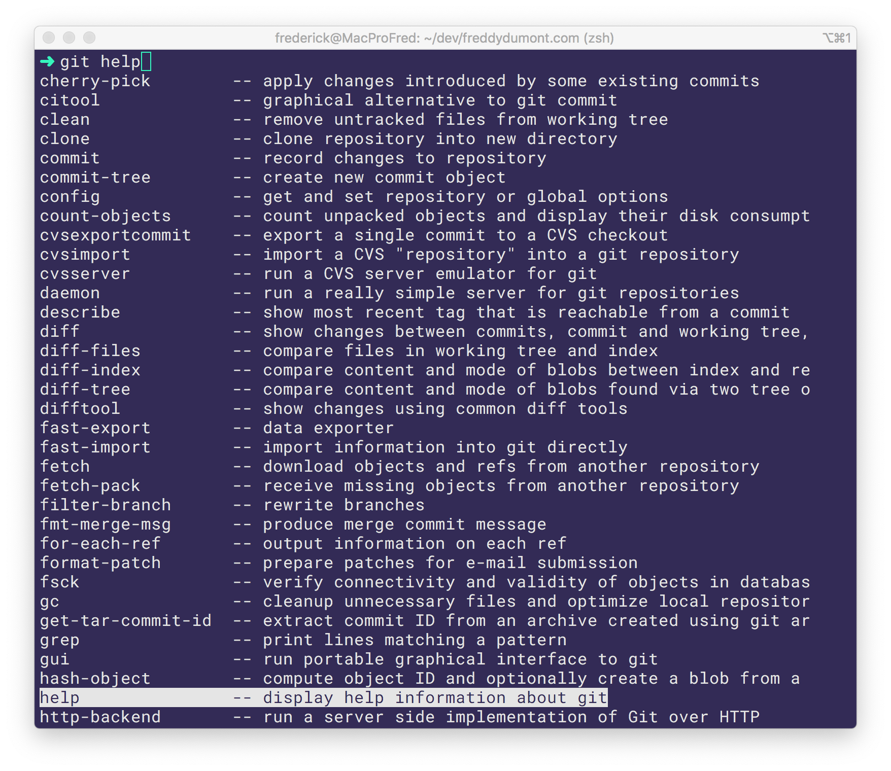
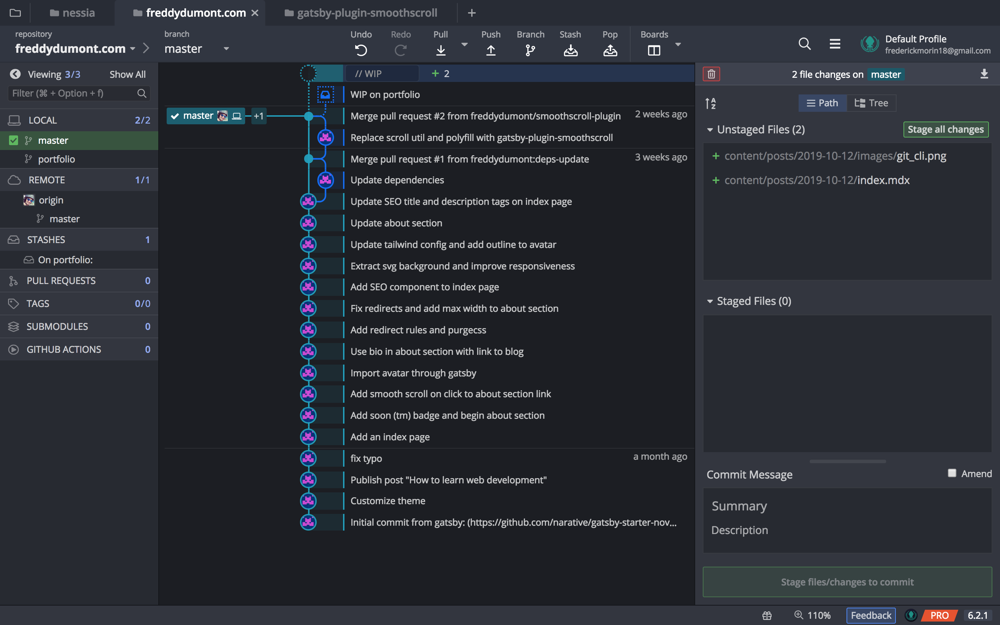

Learning Git isn't about memorizing commands. It's about **understanding** version control. I suggest using a graphical user interface (GUI) instead of a command line interface (CLI) to do that.

The idea that using the command line exclusively makes you a better developer, or worse, a _real developer™_ , is misleading for newbies and even for more experienced developers. I've seen people from all levels carry this assumption, and I've seen this assumption limit the developer's abilities every time.

Such a thought, when religiously adhered to by developers, is limiting their ability to do great work, to seek the best solution to the problem and to avoid basic mistakes. This can be adapted to any other area where developers tend to become zealous, but in my experience, Git and version control has been a good example.

That's because there are amazing GUI tools for Git. I personally use [GitKraken](https://www.gitkraken.com/invite/qTgsLk53) but any Git client with the same features would do the trick.

The main difference between the command line and a GUI is _usability_. Let's examine using screenshots.

  

Here's the interface when you use autocompletion on the command line. A list of all possible Git commands. Not so user friendly.

What ends up happening is that, rather than learning Git concepts, you end up memorizing specific commands and stay at the most basic level. Pull, push, branch, add, commit. That's pretty much it.

But Git is more powerful than that. The issue with the command line is that you don't see what's available.

That _"Fix typo"_ commit could have been **squashed** with the previous one before pushing. That _"Saving changes"_ commit is cluttering the git history and is meaningless to anybody else but you at that exact point in time (try remembering what that commit was about a month later). **Stashing** your work in progress is what you're most likely trying to do.

  

Here's the difference when using a Git GUI with an intuitive interface. What's interesting is that only _relevant commands_ are displayed. And the interface adapts to your actions. It shows you what commands are available for a specific commit, or for a list of commits, or for a single file, or for many files... you get the idea.

What's more is that it even makes you a better CLI Git user. Why? Because a GUI like GitKraken doesn't hide anything from you. The command names are the same as the CLI. Not only will you learn Git _concepts_ but you'll learn the commands.

I won't go on about what the GUI can do so if you want to know more, check out [GitKraken's feature page](https://www.gitkraken.com/git-client).

The purpose of this post was to show you that dogmatism in software development rarely leads to effectiveness and efficiency and to point out that what's most important is to **understand** what you're doing before trying to memorize how to do it.

I hope this post was instructive. If you found it helpful, [follow me on Twitter](https://twitter.com/_freddydumont) to be notified when I post the next one! And if you want to start using GitKraken, feel free to use my [invite link](https://www.gitkraken.com/invite/qTgsLk53).
